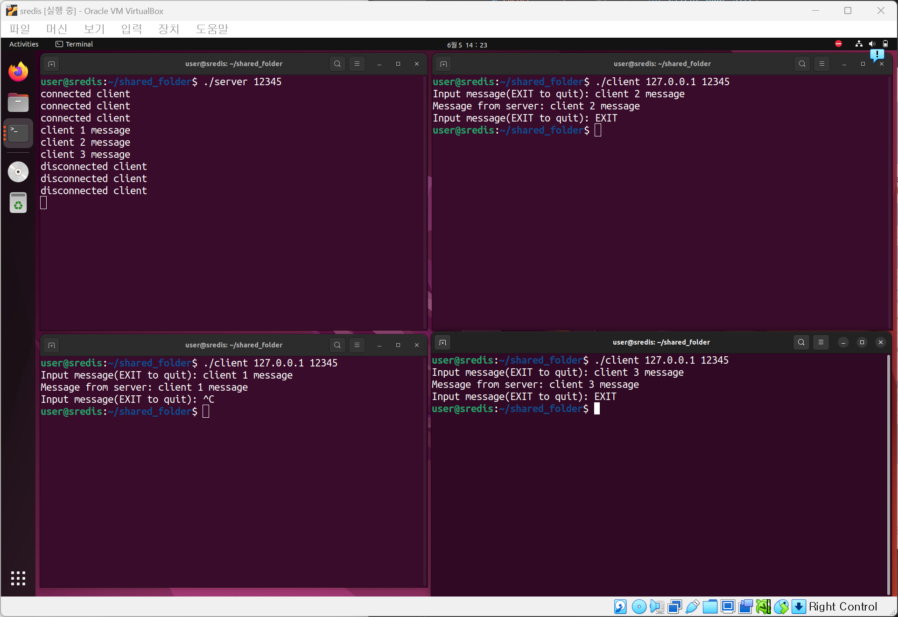
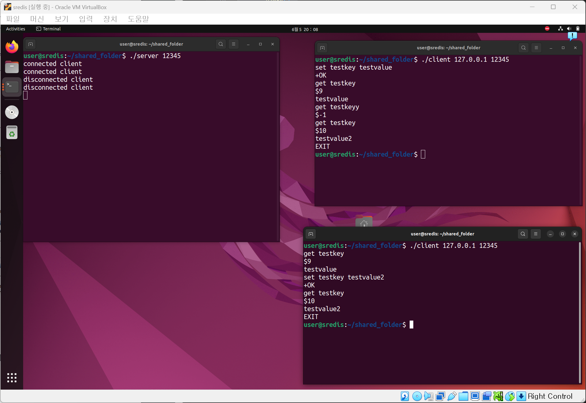

redis와 유사하게 작동하는 server-client 서비스를 만들기 전에, 우선 client 및 multi client와 응답을 주고받을 수 있는 server(echo server)를 각각 구현하고자 하였다. 우선 socket api 함수들에 대해 조사하였다.

### Socket API function

[<sys/socket.h>](https://pubs.opengroup.org/onlinepubs/007908775/xns/syssocket.h.html)

- `int socket(int domain, int type, int protocol);`
    - 각 Socket마다 구분지을 수 있는 descriptor를 생성할 때 사용, 네트워크 프로그래밍에서 가장 처음 사용되는 함수
    - `domain` : 어떤 영역에서 통신할 것인지에 대한 영역
        - `PF_INET` : IPv4 프로토콜
        - `PF_INET6` : IPv6 프로토콜
        - `PF_LOCAL` : LOCAL 통신을 위한 UNIX 프로토콜
        - `PF_PACKET` : Low Level Socket(RAW Socket)을 위한 인터페이스
        - `PF_IPX` : IPX 노벨 프로토콜
    - `type` : 소켓의 형태
        - `SOCK_STREAM` : 스트림, TCP Socket 할당
        - `SOCK_DGRAM` : 데이터 그램, UDP Socket 할당
        - `SOCK_RAW` : RAW Socket 할당, 프로토콜의 헤더를 직접 다룰 때 사용
    - `protocol` : 사용할 통신 프로토콜
        - `IPPROTO_TCP` : TCP 프로토콜
        - `IPPROTO_UDP` : UDP 프로토콜
        - `IPPROTO_HOPOPTS` , `0` : domain, type에 따라 프로토콜 자동 지정
    - return 값
        - 각각의 Socket을 구분할 수 있는 Socket descriptor
        - 에러가 발생하면 음수 return
- `int connect(int socket, const struct sockaddr *address, socklen_t address_len);`
    - 연결하고자 하는 주소(서버 등)에 연결할 때 사용하는 함수
    - `socket` : Socket descriptor, socket() 함수의 return값
    - `sockaddr *address` : 접속하고자 하는 IP와 PORT 정보가 있는 sockaddr 구조체 주소
        - sockaddr struct
        
        ```c
        struct sockaddr {
        		u_short   sa_family;    // 주소 체계를 구분
        		char      sa_data[14];  // 실제 주소를 저장(ip, port)
        }
        ```
        
        sockaddr 구조체에서 `sa_family`가 `AF_INET`인 경우에 사용하는 구조체가 따로 존재한다.
        
        - sockaddr_in struct
        
        ```c
        struct sockaddr_in {
        		short     sin_family;          // 주소 체계: AF_INET
        		u_short   sin_port;            // 16 비트 포트 번호, network byte order
        		struct    in_addr  sin_addr;   // 32 비트 IP 주소
        		char      sin_zero[8];         // 전체 크기를 16 비트로 맞추기 위한 dummy
        };
        
        struct  in_addr {
        		u_long  s_addr;               // 32비트 IP 주소를 저장
        };
        ```
        
        sockaddr 구조체가 총 2byte(u_short) + 14byte(char array) = 16byte 이기 때문에 sockaddr_in 구조체도 크기를 맞추기 위해 마지막 8byte를 맞추기 위한 dummy값이 존재한다. 또한 sockaddr_in 구조체는 sockaddr 구조체의 ip와 port가 동시에 저장되는 문제를 해결하기 위해 `sin_port`와 `sin_addr`로 나누어 저장하였다.
        
    - `address_len` : sockaddr 구조체의 크기
    - return 값
        - 연결하려는 대상과 연결이 성공하면 0 return
        - 연결이 실패하면 음수 return
- `int bind(int socket, const struct sockaddr *address, socklen_t address_len);`
    - 서버에서 사용하는 함수, 생성된 Socket에 IP와 port를 할당할 때 사용
    - `socket` : Socket descriptor, socket() 함수의 return값
    - `sockaddr *address` : 접속하고자 하는 IP와 PORT 정보가 있는 sockaddr 구조체 주소. 서버의 ip주소와 port 번호가 포함되어 있음.
    - `address_len` : sockaddr 구조체의 크기
    - return 값
        - 연결하려는 대상과 연결이 성공하면 0 return
        - 연결이 실패하면 -1 return
- `int listen(int socket, int backlog);`
    - `socket` : Socket descriptor, socket() 함수의 return값. 연결 요청 대기상태에 두고자 하는 Socket descriptor 사용
    - `backlog` : outstanding connection 수 제한, queue의 크기가 되어 backlog만큼의 수의 client의 연결 요청을 대기시킬 수 있다.
    - return 값
        - client의 연결이 성공적으로 완료되면 0 return
        - client의 연결이 실패하면 -1 return
- `int accept(int socket, struct sockaddr *address, socklen_t *address_len);`
    - 연결 대기열(queue)에서 가장 앞에 있는 연결 요청 가져옴. 성공적으로 가져오면 client와 통신을 위한 연결 Socket 생성
    - `socket` : Socket descriptor
        - `socket()`을 사용해 생성되고, `bind()`을 사용해 주소에 바인딩 되었으며, `listen()`에 대해 성공적인 호출을 실행할 경우에 Socket 지정
    - `sockaddr *address` : 연결 소켓의 주소가 반환될 sockaddr 구조체에 대한 포인터
    - `socklen_t *address_len` : client address size가 저장된 포인터
    - return 값
        - 성공적으로 요청을 가져오면 허용된 socket에 대한 file descriptor를 return
        - 실패하면 -1 return
- `ssize_t send(int socket, const void *message, size_t length, int flags);`
    - 지정된 socket을 통해 peer로 메시지 전송. socket이 연결된 경우에만 메시지를 보낸다.
    - 송신 socket에 전송할 메시지를 보관할 공간이 없고 socket descriptor에 `O_NONBLOCK`이 설정되어 있지 않으면 공간 사용이 가능해질 때까지 `send()`가 차단된다. `O_NONBLOCK`이 설정되어 있다면 `send()`가 실패한다.
    - `socket` : 메시지를 전송할 socket descriptor
    - `message` : 보낼 메시지의 buffer
    - `length` : 메시지 길이(byte). 메시지가 너무 길어 protocol을 통과할 수 없으면 메시지 전송이 실패한다.
    - `flags` : 전송할 데이터 또는 읽는 방법에 대한 option.
        - `0` : 일반 데이터 전송
        - `MSG_DONTROUTE` : gateway를 거치지 않고 직접 상대 시스템으로 전송
        - `MSG_DONTWAIT` : non blocking에서 사용하는 옵션으로 전송이 block되면 오류 return
        - `MSG_OOB` : out-of-band data 전송. `SOCK_STREAM` 에서만 지원
    - return 값
        - 성공적으로 메시지를 보내면 보낸 데이터 바이트 수를 return
        - 메시지 전송에 실패하면 -1 return
- `ssize_t recv(int *socket*, void **buffer*, size_t *length*, int *flags*);`
    - connetction-mode나 connectionless-mode scoket으로부터 메시지를 받는 함수
    - 메시지가 너무 길어 제공된 buffer보다 크고 `MSG_PEEK`가 설정되지 않은 경우, 초과된 바이트는 삭제
    - `socket` : socket file descriptor. 해당 socket으로부터 메시지를 받아온다.
    - `buffer` : 받아온 메시지가 저장될 buffer 주소
    - `length` : buffer의 길이
    - `flags` : 메시지 수신 유형 지정
        - `MSG_PEEK` : 수신한 메시지를 엿본다. 메시지는 읽지 않은 것으로 처리
        - `MSG_OOB` : out-of-band data를 요청
        - `MSG_WAITALL` : 전체 데이터 양이 반환될 때까지 function block 호출
    - return 값
        - 성공적으로 전달받으면 전달받은 메시지의 바이트 길이를 return
        - peer가 shutdown되면 0 return
        - 에러 발생시 -1 return
- `int shutdown(int socket, int how);`
    - socket 송신 및 수신 작업 종료할 때 사용
    - `socket` : 작업을 종료하기 위한 socket file descriptor
    
    - `how` : 종료 유형 지정
        - `SHUT_RD` : 추가 수신 작업 비활성화
        - `SHUT_WR` : 추가 송신 작업 비활성화
        - `SHUT_RDWR` : 추가 송신 및 수신 작업 비활성화
    - return 값
        - 성공적으로 작업이 비활성화 되면 0 return
        - 작업 비활성화에 실패하면 -1 return

---

- `int close(int fd);`
    - socket api 관련 함수는 아니고, 단순히 file descriptor를 종료할 때 사용
    - `shutdown()` 과 마찬가지로 socekt으로 통신하다가 통신을 끝낼 때 사용
    - `fd` : 종료할 file descriptor. socket 통신에서는 socket file descriptor를 전달
    - return 값
        - file descriptor를 성공적으로 닫으면 0 return
        - file descriptor를 닫으면 -1 return

### Client

1. server와의 tcp 연결을 위한 client socket 생성
    1. `socket(PF_INET, SOCK_STREAM, 0)`
2. 인자로 넘겨준 ip와 port를 이용하여 server와 connect
    1. `struct sockaddr_in server_addr`
    2. `server_addr.sin_family = AF_INET`
    3. `server_addr.sin_port = htons(port)`
    4. `server_addr.sin_addr.s_addr = inet_addr(argv[1])`
    5. `connect(client_socket, (struct sockaddr*)&server_addr, sizeof(server_addr))`
3. fgets를 이용하여 사용자로부터 입력 받은 후 client socekt을 통해 server로 전송
    1. `fgets(buf, sizeof(buf), stdin)`
    2. `send(client_socket, buf, strlen(buf), 0)`
4. 서버에서 받은 응답을 client의 화면에 출력
    1. `recv(client_socket, buf, BUF_SIZE, 0)`
    2. `printf("Message from server: %s", buf)`
5. EXIT 입력 시 server와 연결 끊기
    1. `close(client_socket)`

### Server

1. client와의 tcp 연결을 위한 server socket 생성
    1. `socket(PF_INET, SOCK_STREAM, 0)`
2. server측 socket을 ip와 port에 연결하기 위한 bind
    1. `struct sockaddr_in server_addr`
    2. `server_addr.sin_family = AF_INET`
    3. `server_addr.sin_port = htons(port)`
    4. `server_addr.sin_addr.s_addr = htonl(INADDR_ANY)`
    5. `bind(server_socket, (struct sockaddr*)&server_addr, sizeof(server_addr))`
3. 최대 5개의 client를 요청 대기시킬 수 있도록 listen
    1. `listen(server_socket, 5)`
4. client와의 연결을 위한 accept
    1. `accept(server_socket, (struct sockaddr*)&client_addr, &client_addr_size)`
5. client로부터 응답 받고 응답을 다시 전송
    1. `recv(client_socket, buf, BUF_SIZE, 0)`
    2. `send(client_socket, buf, len, 0)`
6. client와 연결 끊기면 socket close
    1. `close(client_socket)`
7. 4~6을 여러 client에 대해 작동하기 위해 thread 이용
    1. `pthread_create(&thread, NULL, (void *)&client_connect, (void *)&client_socket)`
    2. `pthread_detach(thread)`

### Base Implementation

앞서 작성한 내용을 코드로 작성하면 아래와 같다.

- client.c

```c
#include <stdio.h>
#include <stdlib.h>
#include <string.h>
#include <unistd.h>
#include <arpa/inet.h>
#include <sys/socket.h>
#include <netinet/in.h>

#define BUF_SIZE 1024

void usage() {
    printf("Usage  : ./client [ip] [port]\n");
    printf("Example: ./client 127.0.0.1 12345\n");
}

int main(int argc, char *argv[]) {
    if (argc != 3) {
        usage();
        return 0;
    }

    int port = atoi(argv[2]);
    int client_socket;

    struct sockaddr_in server_addr;

    char buf[BUF_SIZE];
    int len;

    client_socket = socket(PF_INET, SOCK_STREAM, 0);
    if (client_socket == -1) {
        printf("socket() error");
        return 0
    }

    memset(&server_addr, 0, sizeof(server_addr));
    server_addr.sin_family = AF_INET;
    server_addr.sin_port = htons(port);
    server_addr.sin_addr.s_addr = inet_addr(argv[1]);

    if (connect(client_socket, (struct sockaddr*)&server_addr, sizeof(server_addr)) == -1) {
        printf("connect() error");
        return 0
    }

    while (1) {
        printf("Input message(EXIT to quit): ");
        fgets(buf, sizeof(buf), stdin);

        if (strcmp(buf, "EXIT\n") == 0) {
            break;
        }

        send(client_socket, buf, strlen(buf), 0);
        len = recv(client_socket, buf, BUF_SIZE, 0);
        buf[len] = 0;
        printf("Message from server: %s", buf);
    }

    close(client_socket);
    return 0;
}
```

- server.c

```c
#include <stdio.h>
#include <stdlib.h>
#include <string.h>
#include <unistd.h>
#include <arpa/inet.h>
#include <sys/socket.h>
#include <netinet/in.h>
#include <pthread.h>

#define BUF_SIZE 1024
#define MAX_CLIENT 10

void usage() {
    printf("Usage  : ./server [port]\n");
    printf("Example: ./server 12345\n");

}

void client_connect(void *sd) {
    int client_socket = *(int *)sd;
    char buf[BUF_SIZE];
    int len, res;

    printf("connected client\n");

    while(1) {
        len = recv(client_socket, buf, BUF_SIZE, 0);
        write(1, buf, len);
        res = send(client_socket, buf, len, 0);

        if (res == -1 || res == 0) {
            break;
        }
    }

    printf("disconnected client\n");
    close(client_socket);
}

int main(int argc, char *argv[]) {
    if (argc != 2) {
        usage();
        return 0;
    }

    int port = atoi(argv[1]);
    int server_socket;
    int client_socket;
    int client_addr_size;

    struct sockaddr_in server_addr;
    struct sockaddr_in client_addr;

    char buf[BUF_SIZE];
    int len, res;

    pthread_t thread;

    server_socket = socket(PF_INET, SOCK_STREAM, 0);
    if (server_socket == -1) {
        printf("socket() error\n");
        return 0;
    }

    memset(&server_addr, 0, sizeof(server_addr));
    server_addr.sin_family = AF_INET;
    server_addr.sin_port = htons(port);
    server_addr.sin_addr.s_addr = htonl(INADDR_ANY);

    if (bind(server_socket, (struct sockaddr*)&server_addr, sizeof(server_addr)) == -1) {
        printf("bind() error\n");
        return 0;
    }

    if (listen(server_socket, 5) == -1) {
        printf("listen() error\n");
        return 0;
    }

    client_addr_size = sizeof(client_addr);

    while(1) {
        client_socket = accept(server_socket, (struct sockaddr*)&client_addr, &client_addr_size);
        if (client_socket == -1) {
            printf("accept() error\n");
            return 0;
        }
        
        pthread_create(&thread, NULL, (void *)&client_connect, (void *)&client_socket);
        pthread_detach(thread);
    }

    close(server_socket);

    return 0;
}
```



하나의 server와 여러 client간의 통신이 잘 이루어짐을 확인할 수 있다.

### Redis

redis의 key-value 저장을 위해서 아래와 같은 구조체를 만들어주었다. 과제에서 주어진 대로, 1024자 미만 ASCII 인코딩 문자열에 대해 만들기 위해 MAX_BUF를 1024로 설정해주었다. 또한 키의 개수가 10개 미만이라 했으므로 MAX_LEN을 10으로 설정해주었다.

```c
#define MAX_BUF 1024
#define MAX_LEN 10

typedef struct {
    int idx;
    char key[MAX_LEN][MAX_BUF];
    char value[MAX_LEN][MAX_BUF];
} Redis;
```

다음으로, set 및 get 명령을 위한 함수를 다음과 같이 만들어주었다.

- init

redis 구조체에서 idx값을 -1로 설정해주는 역할을 한다.

```c
int init(Redis *redis) {
    redis->idx = -1;
    pthread_mutex_init(&lock, NULL);
    return 0;
}
```

- isfull

redis 구조체에서 idx값이 MAX_LEN-1과 동일하다면 가득 차 있는 것이므로, true(1)을 return해주고, 그렇지 않을 경우 false(0)을 return 해주는 함수이다.

```c
int isfull(Redis *redis) {
    return redis->idx == MAX_LEN - 1;
}
```

- isempty

redis 구조체에서 idx값이 init에서 설정한 -1과 같다면 비어있다는 것이므로, true(1)을 return해주고, 그렇지 않을 경우 false(0)을 return 해주는 함수이다.

```c
int isempty(Redis *redis) {
    return redis->idx == -1;
}
```

- findkey

redis 구조체에서 이미 존재하는 key의 index를 찾기 위한 함수이다. key가 redis 안에 존재하면 해당 인덱스를 return하고, key가 redis 안에 존재하지 않으면 idx를 1 증가시킨 값을 return한다.

```c
int findkey(Redis *redis, char *key) {
    for (int i = 0; i <= redis->idx; i++) {
        if (strcmp(redis->key[i], key) == 0) {
            return i;
        }
    }

    return redis->idx + 1;
}
```

- set

redis 구조체에 key와 value 쌍을 저장할 때 사용하는 함수로, idx값을 증가시키고 strcpy를 이용하여 전달받은 key와 value를 복사한다. redis가 가득 차있으면 정상적으로 key-value를 입력할 수 없다는 뜻이므로 -1을 return하고, 성공적으로 저장하면 0을 return한다.

redis의 idx를 1 증가시키는 과정과 key와 value를 복사하는 과정은 critical section이다. 즉, key와 value 쌍을 저장할 때 여러 thread들이 동시에 저장을 시도할 경우 충돌이 발생하여 어떤 결과가 저장될지 모르기 때문에 mutex_lock을 이용하여 한번에 하나의 thread만 critical section에 접근가능하도록 하였다.

```c
int set(Redis *redis, char *_key, char *_value) {
    if (isfull(redis) && findkey(redis, _key) == MAX_LEN) {
        return -1;
    }

    pthread_mutex_lock(&lock);

    redis->idx = findkey(redis, _key);
    strncpy(redis->key[redis->idx], _key, strlen(_key));
    redis->key[redis->idx][strlen(_key)] = '\0';
    strncpy(redis->value[redis->idx], _value, strlen(_value));
    redis->value[redis->idx][strlen(_value)] = '\0';

    pthread_mutex_unlock(&lock);

    return 0;
}
```

- get

저장되어있는 redis 개수만큼 for문을 돌면서, 전달받은 key와 일치하는 경우 a 배열에 복사한 다음, 그 길이를 return한다. 만약 redis 구조체가 비어있거나 일치하는 key가 없는 경우 -1을 return한다.

```c
int get(Redis *redis, char *key, char *a) {
    if (isempty(redis)) {
        return -1;
    }

    for (int i = 0; i <= redis->idx; i++) {
        if (strcmp(redis->key[i], key) == 0) {
            strcpy(a, redis->value[i]);
            return strlen(a);
        }
    }

    return -1;
}
```

### Redis Implementation

앞서 작성한 내용을 종합한 코드는 아래와 같다.

- redis.h

```c
# pragma once

#include <string.h>
#include <pthread.h>

#define MAX_BUF 1024
#define MAX_LEN 10

typedef struct {
    int idx;
    char key[MAX_LEN][MAX_BUF];
    char value[MAX_LEN][MAX_BUF];
} Redis;

int init(Redis *redis);
int isfull(Redis *redis);
int isempty(Redis *redis);
int findkey(Redis *redis, char *_key);
int set(Redis *redis, char *_key, char *_value);
int get(Redis *redis, char *_key, char *a);
```

- redis.c

```c
#include "redis.h"

pthread_mutex_t lock;

int init(Redis *redis) {
    redis->idx = -1;
    pthread_mutex_init(&lock, NULL);
    return 0;
}

int isfull(Redis *redis) {
    return redis->idx == MAX_LEN - 1;
}

int isempty(Redis *redis) {
    return redis->idx == -1;
}

int findkey(Redis *redis, char *_key) {
    for (int i = 0; i <= redis->idx; i++) {
        if (strcmp(redis->key[i], _key) == 0) {
            return i;
        }
    }

    return redis->idx + 1;
}

int set(Redis *redis, char *_key, char *_value) {
    if (isfull(redis) && findkey(redis, _key) == MAX_LEN) {
        return -1;
    }

    pthread_mutex_lock(&lock);

    redis->idx = findkey(redis, _key);
    strncpy(redis->key[redis->idx], _key, strlen(_key));
    redis->key[redis->idx][strlen(_key)] = '\0';
    strncpy(redis->value[redis->idx], _value, strlen(_value));
    redis->value[redis->idx][strlen(_value)] = '\0';

    pthread_mutex_unlock(&lock);

    return 0;
}

int get(Redis *redis, char *_key, char *a) {
    if (isempty(redis)) {
        return -1;
    }

    for (int i = 0; i <= redis->idx; i++) {
        if (strcmp(redis->key[i], _key) == 0) {
            strcpy(a, redis->value[i]);
            return strlen(a);
        }
    }

    return -1;
}
```

### Method Implementation

기존에 구현했던 server-client 응답에서 server측에서 `recv()`한 내용을 명령어로 구분지어 get, set 명령어에 맞도록 구현한다. strtok 함수를 사용하여 띄어쓰기와 엔터를 기준으로 buffer를 잘랐고, set, get일 때에 맞추어 동작하도록 하였다. set이나 get이 아니라면 `Invalid command`라는 문자열을 전송한다. 또한, set에서 key와 value를 입력하지 않아도 `Invalid command`라는 문자열을 전송한다.

set을 할 때 Redis가 full이라면 `Redis is full`이라는 문자열을 전송하도록 하였으며, Redis에 넣을 수 있으면 `+OK`를 전송하였다.

get을 할 때 Redis가 비어있거나 key가 존재하지 않는다면 `$-1`을 전송하였고, key가 존재할 경우 `$(전송 길이)\n(value)`를 전송하였다.

```c
while(1) {
    len = recv(client_socket, recvbuf, BUF_SIZE, 0);

    if (len == 0 || len == -1) {
        break;
    }

    char *method = strtok(recvbuf, " ");
    if(strcmp(method, "set") == 0) {
        char *key = strtok(NULL, " ");
        char *value = strtok(NULL, "\n");

        if (key == NULL || value == NULL) {
            strcpy(sendbuf, "Invalid command\n");
        } else {
            ck = set(&redis, key, value);

            if(ck == -1) {
                strcpy(sendbuf, "Redis is full\n");
            } else {
                strcpy(sendbuf, "+OK\n");
            }
        }

    } else if(strcmp(method, "get") == 0) {
        char *key = strtok(NULL, "\n");
        ck = get(&redis, key, recvbuf);

        if(ck == -1) {
            strcpy(sendbuf, "$-1\n");
        } else {
            snprintf(sendbuf, BUF_SIZE + 50, "$%d\n%s\n", ck, recvbuf);
        }
        
    } else {
        strcpy(sendbuf, "Invalid command\n");
    }

    res = send(client_socket, sendbuf, strlen(sendbuf), 0);

    if (res == 0 || res == -1) {
        break;
    }
}
```


